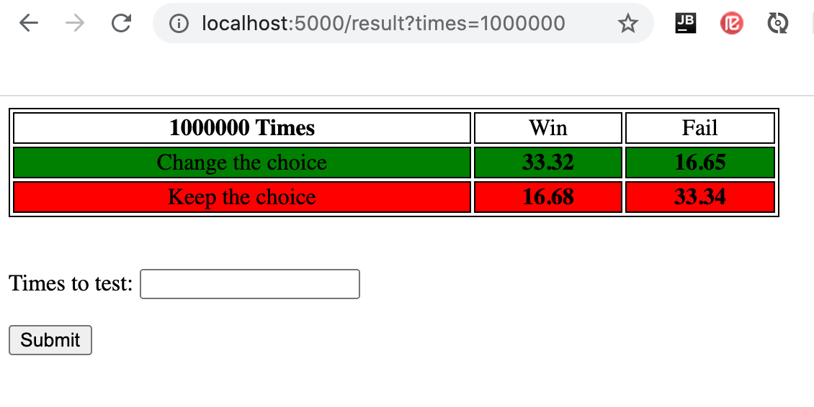

# Monty-hall problem simulation

Java code that simulates the game described in Monty-hall paradox.

The problem is a well-known puzzle that you can read more about at: http://en.wikipedia.org/wiki/Monty_Hall_problem


# Problem description
> Assume that you are attending a TV show where you can win money by picking the right box. The game show host shows you three boxes explaining that the money is in one of the boxes. He asks you to pick one of them without opening it. After you have picked one of the boxes he opens one of the other two boxes which is empty. Now he turns to you and asks, do you want to change your mind, picking the remaining box?


# Requirements
*	Java 11
*	Maven
*   Spring Boot
*	Junit 5

# Run

- Clone the project, navigate to the project root and use Maven to build:
```
mvn clean install
```
- With running the test ```simulate_the_game_with_100_times()``` in ```GameServiceImplTest```
  you can see the result of 100 times running the application.
- Or you can run the application by going to: 
  http://localhost:5000/


# Example outcome

Running the test for 1 million times:


